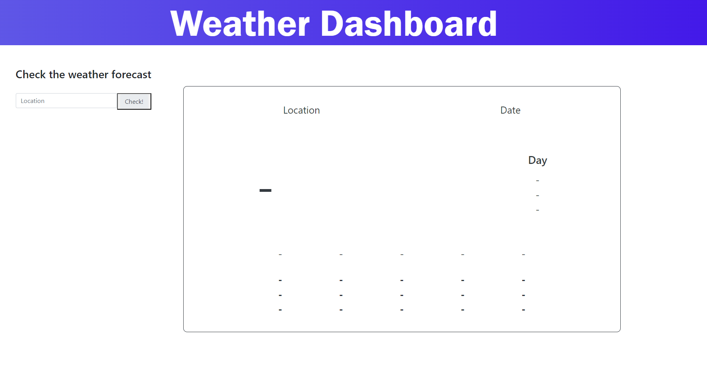
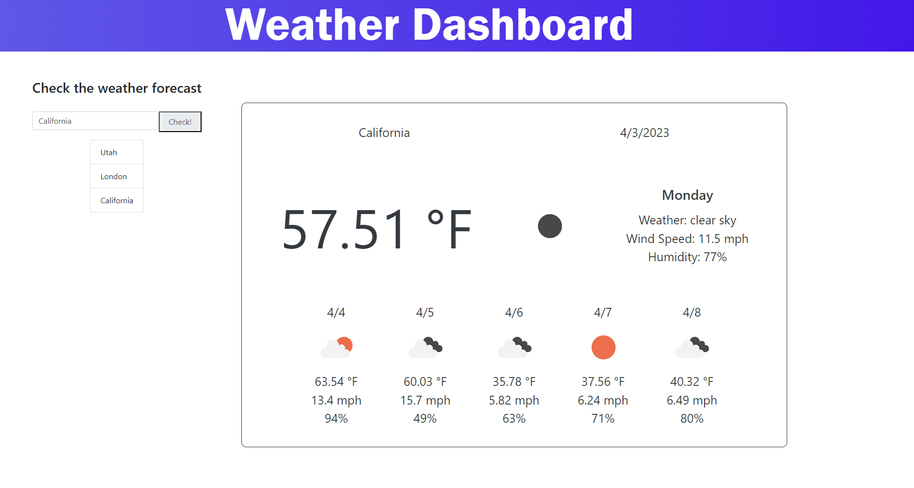

## Weather Dashboard Project

# Description

This program pulls current and 5-day forecasted weather and displays it to the user. To use the program, simply enter the name of a city into the searchbar and click the button. The user may also click one of their past searches to re-display the weather for the selected city. The weather info includes: temperature, wind speed, humidity, a weather condition description, and an icon demonstrating the current weather condition.

# Screenshots

The screenshot below shows the landing page

The screenshot below shows the page after inputting data

# Link to application

https://sohzo.github.io/Weather-Dashboard-Project/

# Sources

Certain parts of this code was built with some inspiration from forums such as stack overflow and reddit.